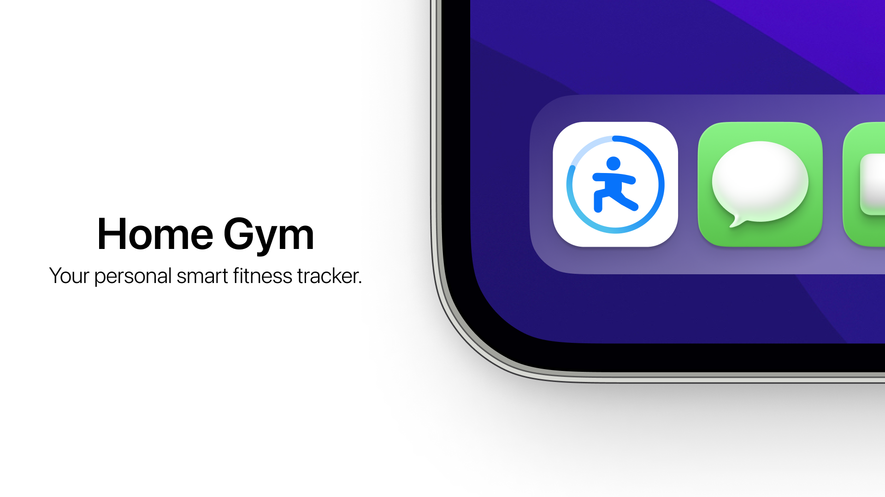
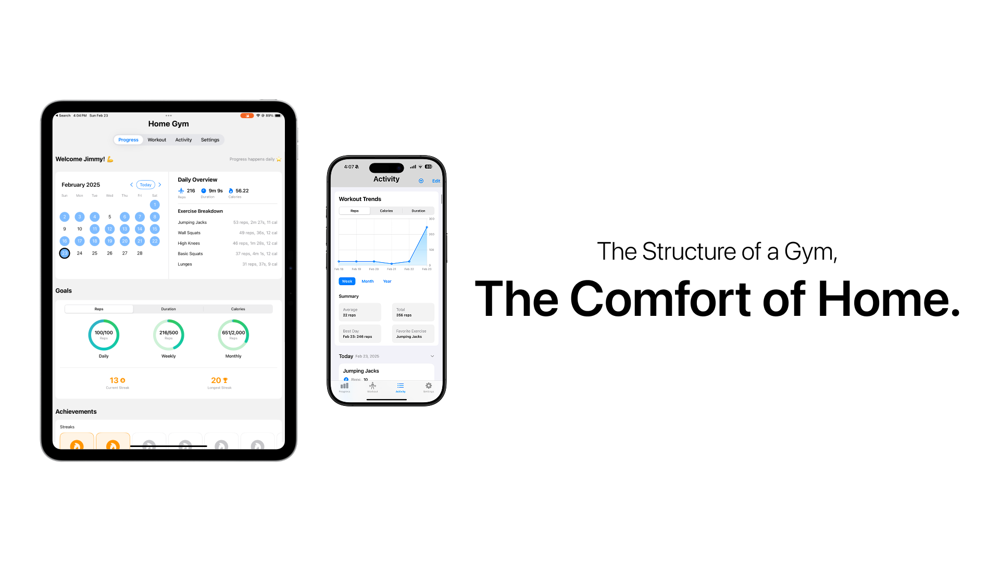
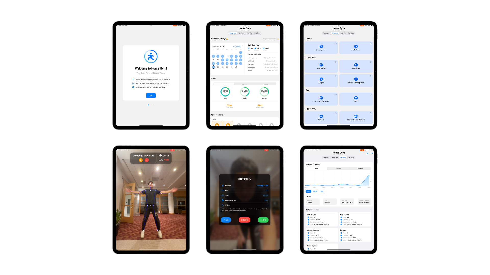

# 🏋️ Home Gym - iOS/iPadOS Fitness App
Developed by James Deming Kong

> **🏆 WINNING SUBMISSION ✅: Apple Swift Student Challenge 2025**
> 
> Interested in the Swift Student Challenge? Learn more [here](https://developer.apple.com/swift-student-challenge/).

**Jan 2025** - **Feb 2025**

## 🎥 Demo Video
[YouTube Link](https://www.youtube.com/watch?v=rw4rHrYH1G0)

## 📄 Essay Portion of Submission
[Written Responses](Written%20Responses.pdf)

## 📌 Overview
**Home Gym** is a **smart personal fitness tracker app** designed to make working out at home more engaging and effective. By leveraging advanced body tracking technology and computer vision, **Home Gym** allows you to monitor your exercises in real-time, ensuring proper form and providing feedback on your progress. The app features comprehensive workout logging and analytics, allowing users to track their fitness journey through detailed exercise metrics, progress visualization, and performance trends. Supporting a variety of exercises, the app includes features like automatic rep counting, personalized goal setting, workout history management, and achievement rewards to keep you motivated.

## 🎯 Key Features

### 🔍 Real-time Body Tracking
- Body tracking and form analysis using Vision Framework
- Automatic rep counting
- Voice guidance and form feedback

### 🏃 Multiple Supported Exercises (`12`)
- **Cardio** 
    - Jumping Jacks 
    - High Knees

- **Lower Body:** 
    - Basic Squats 
    - Wall Squats 
    - Lunges 
    - Standing Side Leg Raises

- **Core:** 
    - Pilates Sit-Ups Hybrid 
    - Planks
    
- **Upper Body:** 
    - Push-Ups 
    - Bicep Curls - Simultaneous 
    - Lateral Raises 
    - Front Raises

### 📊 Detailed Progress Tracking
- Interactive calendar view
- Detailed workout history
- Trend Analytics Charts
- Achievement system

### ⚙️ Customization
- Personal metrics (age, height, weight)
- Daily/Weekly/Monthly goals
- Theme and UI preferences
- Voice feedback options

## 🔧 Technologies Used

- **SwiftUI** – Handles building the app UI and interactions
- **UIKit** - Handles wrapping views and triggering haptics
- **Vision** – Handles real-time body pose tracking
- **AVCaptureSession** – Handles camera input for motion tracking
- **AVFoundation** - Handles audio playback for sound effects
- **CALayer** – Displays overlays for joints and movement guidance
- **AVSpeechSynthesizer** – Provides real-time voice feedback
- **Charts** - For visual analytics and statistics
- **TipKit** - Provides tip info to explain features

## 💾 Installation

### Via Swift Playgrounds (iPad)
1. Download and extract this repository
2. Transfer files to your iPad
3. Open with Swift Playgrounds app
4. Tap the Play button to run

> 📱 [Download Swift Playgrounds](https://apps.apple.com/us/app/swift-playground/id908519492)

### Via Xcode (Mac)
1. Open the project in Xcode
2. Select your target device
3. Click Run (▶️)

[Learn more about running iOS apps in previews and sideloading](https://developer.apple.com/documentation/xcode/running-your-app-in-simulator-or-on-a-device)

## ⭐️ Credits

_Sound Effects: [Material Design](https://m2.material.io/design/sound/sound-resources.html#) ([CC-BY 4.0](https://creativecommons.org/licenses/by/4.0/legalcode))_

_App Lunge Figure Icon: [Warrior Pose Right Vector Icon Design Vectors by Vecteezy](https://www.vecteezy.com/vector-art/20194203-warrior-pose-right-vector-icon-design)_

_iOS/iPadOS App Icon Mock-up: [App Icon Generator](https://www.figma.com/community/file/1087032899919287319) ([CC-BY 4.0](https://creativecommons.org/licenses/by/4.0/))_

_iPhone/iPad Device Mock-ups: [Apple Device Mockups](https://www.figma.com/community/file/1385659531316001292) ([Apple Design Resources License](https://developer.apple.com/support/downloads/terms/apple-design-resources/Apple-Design-Resources-License-20230621-English.pdf))_